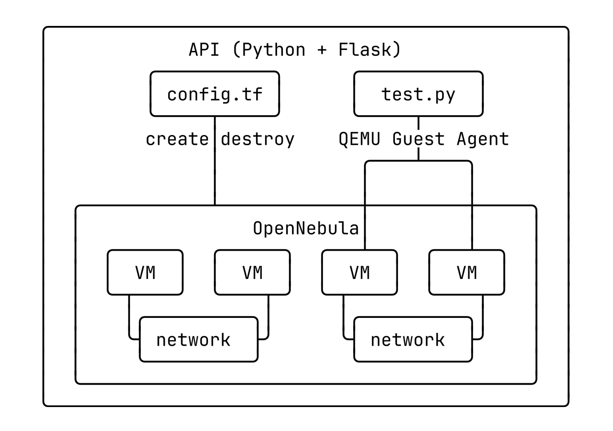
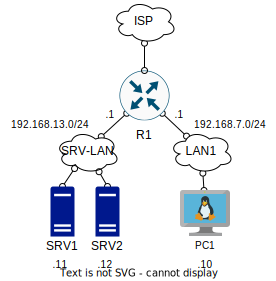

# Crocum [WIP]
<a href="https://olymp.hse.ru/data/2023/04/03/2025606431/%D0%91%D0%B8%D0%B7%D0%BD%D0%B5%D1%81-%D0%B8%D0%BD%D1%84%D0%BE%D1%80%D0%BC%D0%B0%D1%82%D0%B8%D0%BA%D0%B0%20(%D0%92%D1%8B%D1%81%D1%88%D0%B8%D0%B9%20%D0%BF%D0%B8%D0%BB.pdf">

## TL:DR
Crocum is a PaaS designed to train network engineers on automatically created, deleted, and checked by terms of reference network labs.
Educational platforms can access Crocum via the RESTful API written on Flask.

Test instance: crocum.p0li.site [WIP, ip whitelist]

## Why?
~~Because I can.~~ None of the existing solutions on the market, whether for personal or corporate use, can automate the checking of labs. I was very sad to see my teachers spending hours on manual checks. Crocum is suitable for both personal and corporate use, in which case I take care of the servers, the client only needs to use the provided API. 

## Architerture

- #### OpenNebula
Used for globally control VMs, nets, storage, etc on multiple hosts. It is also ideal for horizontal scaling.
- #### Terraform
 Used for declarative description of labs infra (VMs, nets, address ranges, templates, etc).
- #### PyTest & QEMU Guest Agent
VMs are in isolated networks, making it impossible to use Ansible/Salt. So I decided to use for checking purposes tests written on PyTest with module testinfra. Then tests are run on VMs using QEMU Guest Agent, tracing their output.
- #### Flask
Crocum's final form, allowing create, destroy and check labs by one request. PostgreSQL is used for storing info about users and labs.

## Example of lab (named lab1)

Terraform configs for this lab are stored in ./terraform/lab1, tests are stored in ./tests

## TODO
- [X] Write a delightful README
- [ ] Finalize qemu-ga module for API
- [ ] DOCKERIZE!!111!!
- [ ] Deploy a pretty cluster of >= 3 OpenNebula instances 
- [ ] Fix phantom problem with Terraform (troubles with OpenNebula provider???)
- [ ] Draw cute logo
- [ ] Maybe create simple frontend??? 

