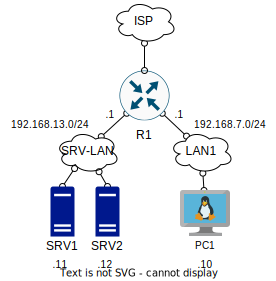

# Crocum
## RU:
### Концепция:
Архитектура и API для сервиса по подготовке сетевых администраторов.
### Реализация:
Системных администраторов обычно обучают на лабораторных - пуле виртуальных машин, изолированных от окружающего мира и требующих настройки. Проверка этих лабораторных обычно проводится мануальная. Моя идея заключается в том, чтобы полностью автоматизировать процесс разворачивания, удаления и тестирования виртуалок. За основу берется OpenNebula, облачная система, масштабируемая как горизонтально, так и вертикально. Для создания и уничтожения лабораторных используется Terraform, для их проверки - PyTest тесты, для засыла тестов в виртуалки - QEMU Guest Agent. Весь функционал завернут в RESTful API, написанный на Flask.
### Cхема тестовой лабораторной:

### Todo:
- [X] Написать tf-конфиги и отладить
- [X] Разобраться с QEMU guest agent и написать скрипты для автоматизации работы с ним
- [X] Написать пробный тест, проверить на работоспособность
- [X] Написать базовый рабочий API, создающий и уничтожающий лабораторку
- [X] Придумать название для проекта
- [X] Добавить БД для работы с пользователями и лабами
- [ ] Нарисовать лого
- [ ] Написать тесты для лабораторной
- [ ] Написать документацию для лабораторной
- [ ] Написать обвязку для работы контекстуализации Opennebula на OPNsense
- [ ] Поднять в кластер в облаке с Open vSwitch и Seph
- [ ] Завернуть в Docker
- [ ] Закончить образы ОС
- [ ] Создать примитивный фронт
